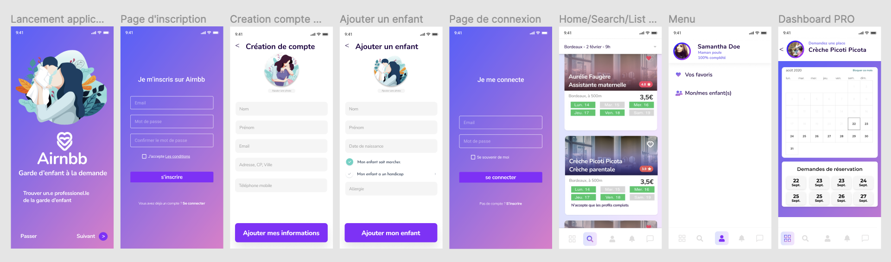
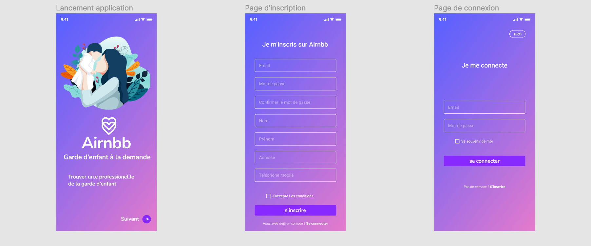

# Airnbb 📝

(**In progress**, still working on it...)

# The application 📱

Welcome to Airnbb - Connecting Parents and Nurseries!

## Overview 🔬

Airnbb is a peer-to-peer platform designed to facilitate the connection between parents seeking childcare services and nurseries offering their expertise. Much like the popular accommodation platform Airbnb, Airnbb simplifies the process of finding and booking childcare services for parents while allowing nurseries to showcase their availabilities.

## Features 💈

### Parent's Perspective 👨‍👩‍👧‍👧

- **User Registration**: Parents can easily sign up on the website, creating an account to manage their childcare needs.

- **Browse Nurseries**: Explore a variety of nurseries, each offering unique services and features.

- **Booking System**: Parents can book specific time slots for childcare, providing flexibility and convenience.

### Nursery's Perspective 🏫

- **Nursery Registration**: Nurseries can register on the platform, providing details about their services and facilities.

- **Availability Management**: Easily add and manage available time slots, along with the number of spots and overall availability.

- **Visibility**: Nurseries can showcase their facilities and services to attract potential clients.

# Launch project 🚀🚀

- Clone the repo, and enter it.
- `git checkout dev`.
- `npm i` in the root directory.

- create `.env` files following the `.env.sample` files patern.
- ask the Airnbb dev team for the credentials needed to access MongoDB collections.

- `npm run dev` in the root directory. Enjoy.

# Getting Started 🏃‍♂️🏃‍♀️

To get started with Airnbb, follow these simple steps:

1. **Sign Up**: Create your account as a parent or a nursery.

2. **Explore**: Browse through the list of nurseries to find the perfect match for your childcare needs.

3. **Book**: For parents, select a suitable time slot and book your child's spot. For nurseries, manage your availability and showcase your services.

4. **Connect**: Communicate with nurseries or parents through the platform to coordinate and ensure a smooth childcare experience.

## Why Airnbb? 👶🏼👶🏿👶🏽👶

- **Convenience**: Streamlined process for parents to find suitable childcare options and for nurseries to manage their bookings.

- **Flexibility**: The booking system allows parents to choose specific time slots, providing flexibility in childcare arrangements.

- **Community Connection**: Build a community of parents and nurseries, fostering a sense of trust and reliability.

# More about us... 👨🏼👨🏽👨🏿👩‍🦰

- Meet the dedicated and vibrant team behind Airnbb! Comprising hard workers, cosmopolitan individuals, and a touch of humor, our team is passionate about creating an innovative platform that transforms the childcare experience.

- Together, our team collaborates seamlessly, combining hard work, a global mindset, and a good dose of humor to bring you the best childcare platform, Airnbb. We believe that a happy team results in a happy and successful product for our users.

# Tools 🛠️ 🪛 🪚

- [Vite](https://www.npmjs.com/package/vite)
- [Express](https://www.npmjs.com/package/express)
- [Nodemon](https://www.npmjs.com/package/nodemon)
- [Dotenv](https://www.npmjs.com/package/dotenv)
- [React-router-dom](https://www.npmjs.com/package/react-router-dom)
- [MongoDB](https://www.mongodb.com/) (more about it below ..)
- [Mongoose](https://www.npmjs.com/package/mongoose)
- [Husky](https://www.npmjs.com/package/husky) 🐶
- [Eslint](https://www.npmjs.com/package/eslint)

## MongoDB 🌿

- MongoDB is a document database with the scalability and flexibility that you want with the querying and indexing that you need.

### What is the difference between SQL and NoSQL ? 🤷‍♀️

- SQL databases are used to store structured data while NoSQL databases like MongoDB are used to save unstructured data. MongoDB is used to save unstructured data in JSON format. MongoDB does not support advanced analytics and joins like SQL databases support.

- In comparison to the SQL server, **MongoDB is faster and more scalable.**

### You want to learn more about MongoDB ? 💡

- Well you should ! And we strongly recommend you follow this amazing tutorial on how to use MongoDB locally on your shell 👇.

[NetNinja - MongoDB Tutorial](https://www.youtube.com/playlist?list=PL4cUxeGkcC9h77dJ-QJlwGlZlTd4ecZOA)

## Contributing 🛟

If you'd like to contribute to Airnbb, feel free to submit a pull request. We welcome your ideas and enhancements!

## License 🚨

This project is licensed under the [MIT License](LICENSE.md).

Thank you for choosing Airnbb! We hope it makes your childcare experience seamless and enjoyable. If you have any questions or feedback, please reach out to us.